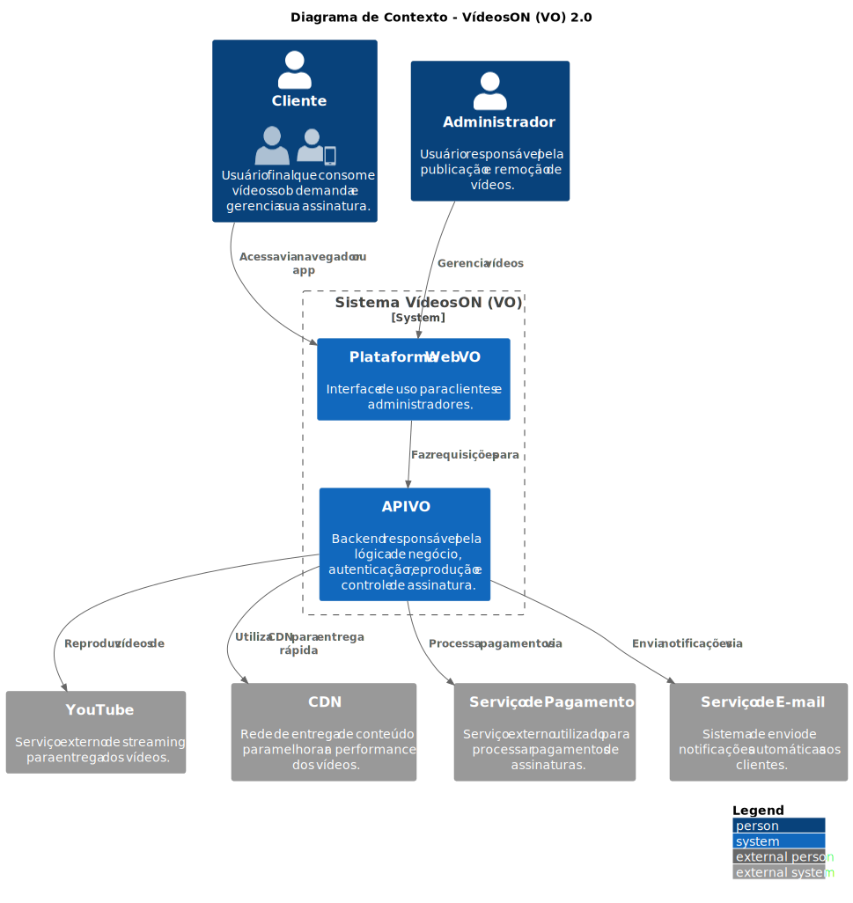
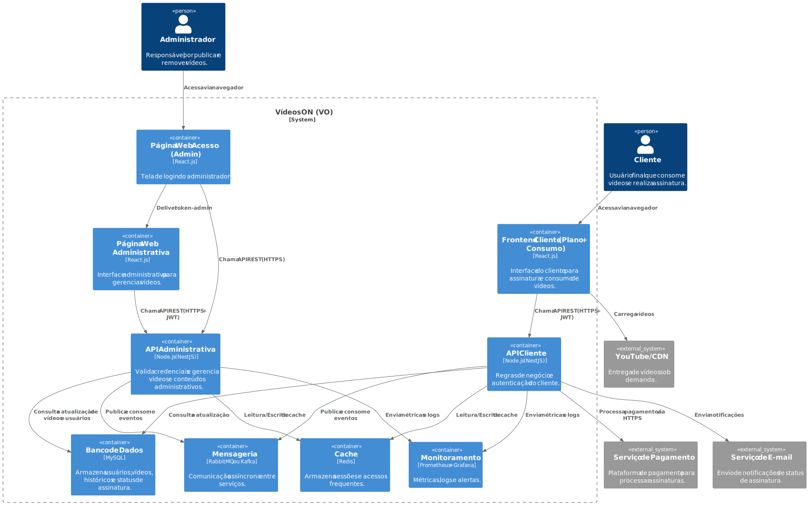
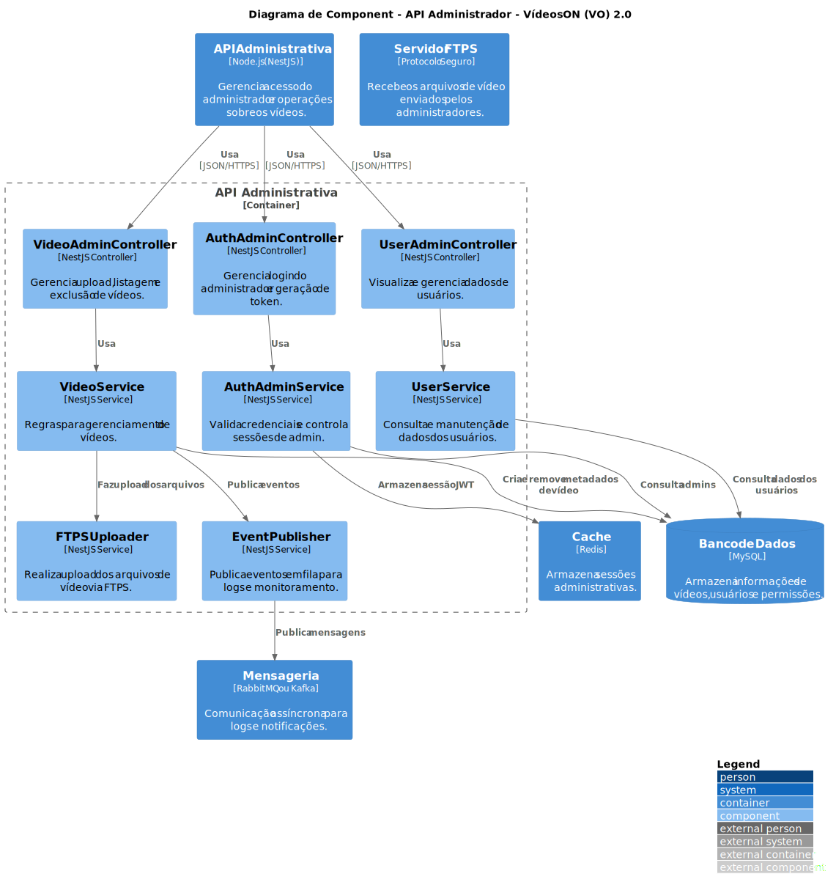
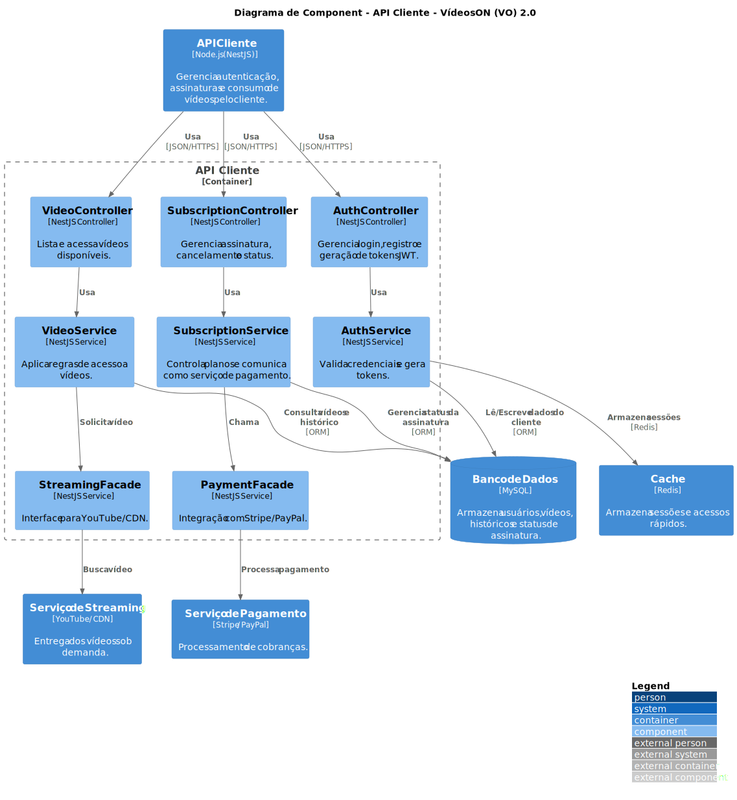

# Arquitetura de Software - VídeosON (VO) 

## Requisitos Funcionais e Não Funcionais v-1.0

Detalhamento dos requisitos da arquitetura da aplicação **VídeosON (VO)** que servem como base para a definição da estrutura do sistema, dos módulos funcionais e das tecnologias adotadas.

### Requisitos Funcionais (RF)

| Código | Descrição                                                                 |
|--------|---------------------------------------------------------------------------|
| RF1    | Permitir o cadastro de novos usuários (clientes).                        |
| RF2    | Realizar autenticação segura dos usuários.                               |
| RF3    | Permitir a reprodução de vídeos sob demanda.                             |
| RF4    | Verificar se o vídeo já foi consumido anteriormente pelo cliente.        |
| RF5    | Garantir a continuidade da reprodução em caso de interrupções.           |
| RF6    | Tolerar falhas durante a reprodução, com reinicialização automática.     |
| RF7    | Permitir que administradores publiquem e removam vídeos da plataforma.   |

### Requisitos Não Funcionais (RNF)

| Código | Descrição                                                                 |
|--------|---------------------------------------------------------------------------|
| RNF1   | Utilizar serviços de streaming (como YouTube) com suporte a diferentes resoluções e proporções. |
| RNF2   | Apresentar mensagens informativas padronizadas ao usuário.               |
| RNF3   | Garantir uma interface responsiva em diferentes dispositivos.            |
| RNF4   | Adotar práticas de UX Design para fluidez na navegação.                  |
| RNF5   | Fornecer feedback visual e textual ao usuário em ações relevantes.       |

## Visão Geral - Macro da Aplicação

A aplicação VídeosON (VO) é uma plataforma de streaming voltada para o consumo e gerenciamento de vídeos sob demanda. Os usuários finais (clientes) poderão se cadastrar, autenticar e consumir vídeos por meio da aplicação, enquanto administradores terão a capacidade de publicar e organizar os conteúdos. A aplicação deve proporcionar uma experiência de uso fluida, segura e escalável, garantindo o cumprimento de requisitos funcionais e não funcionais.

### Diagrama de Casos de Uso (ASCII)

                                   ┌──────────────┐
                                   │   Usuário    │
                                   └──────┬───────┘
                                          │
                                          │
                                          ▼
                               ┌─────────────────────┐
                               │   Validar Acesso    │◄─── include ───
                               └─────────────────────┘
                                          │
                  ┌───────────────────────┼───────────────────────┐
                  ▼                       ▼                       ▼
          «Cadastrar Usuário»      «Consumir Vídeo»      «Visualizar Histórico»
                                          │
                        ┌─────────────────┼─────────────────┐
                        ▼                                   ▼
                «Controlar Interrupção»        «Verificar Vídeo Consumido»

                                   ┌──────────────┐
                                   │ Administrador│
                                   └──────┬───────┘
                                          │
                                          ▼
                                   «Publicar Vídeo»

A solução proposta deverá garantir:

- Cadastro e autenticação de clientes com segurança e controle de sessões.
- Disponibilização de vídeos com verificação de consumo anterior.
- Tolerância a falhas e reinicialização em caso de erros durante a reprodução.
- Administração do conteúdo por meio de funcionalidades exclusivas para administradores.
- Interface padronizada, responsiva e orientada a práticas de UX Design.
- Monitoramento ativo do desempenho e das falhas da aplicação.

## Visão Tecnológica

### Estilo de Arquitetura

A arquitetura será orientada a microsserviços, permitindo a escalabilidade horizontal da aplicação e a separação clara de responsabilidades entre os componentes. A comunicação entre os serviços será realizada por meio de APIs REST e, para eventos críticos como falhas de execução, será adotada arquitetura orientada a eventos (Event-Driven Architecture).

A entrega dos vídeos será otimizada por meio de integração com serviços como YouTube (atendendo aos requisitos de resolução e proporção) e o uso de CDN (Content Delivery Network) para reduzir latência.

### Tecnologias e Ferramentas

| Camada              | Tecnologias                                   | Descrição                                                                |
|---------------------|-----------------------------------------------|--------------------------------------------------------------------------|
| Frontend            | React.js                                      | Desenvolvimento da interface de usuário responsiva                       |
| Backend             | Node.js (NestJS)                              | Processamento de regras de negócio, autenticação e APIs REST             |
| Banco de Dados      | MySQL                                         | Armazenamento de usuários, vídeos e históricos de consumo                |
| Cache               | Redis                                         | Otimização de desempenho em acessos frequentes                           |
| Autenticação        | JWT (JSON Web Token)                          | Controle seguro e escalável de sessões                                   |
| Mensageria          | RabbitMQ ou Apache Kafka                      | Comunicação assíncrona entre microsserviços                              |
| Streaming           | API do YouTube + CDN                          | Entrega de vídeos com base em RNF1 e performance otimizada               |
| Monitoramento       | Prometheus e Grafana                          | Acompanhamento de falhas, latência e outros indicadores                  |
| Infraestrutura      | Docker, Kubernetes (opcional), GitHub Actions | Containerização, CI/CD, automação de deploy                              |

### Módulos e Componentes

| Módulo                        | Responsabilidade                                                          |
|------------------------------|---------------------------------------------------------------------------|
| Cadastro e Autenticação      | Gerencia criação de contas e acesso de clientes (RF1, RF2)                |
| Consumo de Vídeos            | Gerencia reprodução, interrupções e verificações de consumo (RF3, RF4, RF5, RF6) |
| Administração de Conteúdo    | Permite a publicação e exclusão de vídeos por administradores (RF7)       |
| Histórico de Consumo         | Registra e apresenta os vídeos já assistidos pelo cliente                 |
| Notificações e UX            | Exibe mensagens informativas padronizadas (RNF2, RNF3, RNF4, RNF5)        |
| Monitoramento e Tolerância   | Detecta falhas e garante tentativas de recuperação automáticas            |

### Observações Finais

A arquitetura proposta prioriza a experiência do usuário, a robustez da entrega de conteúdo e a facilidade de manutenção e escalabilidade do sistema. A segmentação por módulos e o uso de microsserviços contribuem para a evolução contínua da aplicação, com mínimo impacto entre as funcionalidades.

A integração com serviços externos como YouTube e o uso de CDN garantem o desempenho necessário para uma aplicação de streaming moderna. Os padrões adotados de autenticação e monitoramento asseguram a confiabilidade da solução.

##  Requisitos da Versão v-2.0

### Requisitos Funcionais (RF) – Novos

| Código | Descrição |
|--------|-----------|
| RF8    | Permitir que o cliente selecione entre assinatura mensal ou anual. |
| RF9    | Integrar com serviço externo de pagamento para processar assinaturas. |
| RF10   | Controlar o status da assinatura do cliente (ativa, inativa, vencida). |
| RF11   | Restringir o consumo de vídeos a um por mês para usuários sem assinatura. |
| RF12   | Liberar acesso irrestrito a vídeos para clientes com assinatura ativa. |

###  Requisitos Não Funcionais (RNF) – Novos

| Código | Descrição |
|--------|-----------|
| RNF6   | Garantir integração segura com o serviço de pagamento via HTTPS e tokens. |
| RNF7   | Notificar o cliente sobre o status da assinatura via e-mail e interface. |
| RNF8   | Garantir disponibilidade mínima de 99,9% no serviço de autenticação e cobrança. |
| RNF9   | Registrar logs de eventos relacionados a pagamentos e acessos. |

### Diagrama de Casos de Uso (ASCII)

                                           ┌──────────────┐
                                           │   Cliente    │
                                           └──────┬───────┘
                                                  │
                                                  ▼
                                     ┌───────────────────────┐
                                     │     Validar Acesso    │ ◄──────────── include ──────────┐
                                     └───────────────────────┘                                 │
                                                  │                                            │
                      ┌───────────────────────────┼───────────────────────────┐                │
                      ▼                           ▼                           ▼                │
                «Cadastrar Usuário»        «Consumir Vídeo»     «Visualizar Histórico»         │
                                                      │                                        │
                                 ┌────────────────────┼──────────────────────────────────┐     │
                                 ▼                                                       ▼     ▼
                      «Verificar Vídeo Consumido»                             «Verificar Status da Assinatura»
                                 ▲                                                          │
                                 │                                                          ▼
                    «Controlar Interrupção»                                  «Restringir Consumo de Vídeos»
                                                                                            │
                                                                                            ▼
                                                                                «Liberar Acesso Ilimitado»

                                       ┌─────────────────┐
                                       │  Administrador  │
                                       └────────┬────────┘
                                                │
                                                ▼
                                  «Publicar ou Remover Vídeos»

                                     ┌───────────────────────┐
                                     │ Serviço de Pagamento  │
                                     └───────────┬───────────┘
                                                 ▼
                                 «Processar Assinatura do Cliente»

                                       ┌────────────────────┐
                                       │ Serviço de E-mail  │
                                       └─────────┬──────────┘
                                                 ▼
                                   «Notificar Status da Assinatura»

---

#  Modelo C4 – Sistema VO 2.0

##  Nível 1: Diagrama de Contexto

*Explicação:*
- Cliente e Administrador interagem com a Plataforma Web.
- A plataforma se comunica com uma API backend para gerenciar tudo.
- A API interage com YouTube/CDN (para vídeos), Serviço de Pagamento e Serviço de E-mail.

##  Nível 2: Diagrama de Containers

*Explicação:*
- **Web Application:** Interface acessada pelos usuários via navegador, feita com React.js ou Vue.js.
- **Mobile App:** Aplicativo móvel para consumidores de vídeos, feito com React Native ou Flutter.
- **API Backend:** Servidor de backend, responsável pela lógica de negócios, autenticação, controle de assinaturas e gerenciamento dos dados, feito com Node.js (NestJS) ou Spring Boot.
- **Banco de Dados:** Armazena todos os dados críticos, como usuários, vídeos e status de assinatura, usando MySQL ou PostgreSQL.
- **Serviço de Autenticação:** Usado para gerenciar a autenticação dos usuários com JWT.
- **Serviço de Pagamento:** Serviço que lida com o processamento de pagamentos, como PayPal ou Stripe.
- **Serviço de Streaming:** Lida com a entrega de vídeos aos usuários através da API do YouTube e CDN.

##  Nível 3: Diagrama de Componentes

### Diagrama de Componentes – API Adm

*Explicação:*
- **API Application:** O backend que gerencia autenticação, vídeos e assinaturas.
- **Banco de Dados:** Armazena informações dos usuários, vídeos, histórico e status da assinatura.
- **Serviço de Streaming:** Utiliza a API do YouTube e uma CDN para entregar vídeos.
- **Serviço de Pagamento:** Gerencia transações de pagamento por meio de integração com APIs externas (PayPal, Stripe).

### Diagrama de Componentes – API Cliente

**Componentes dentro da API Application:**
- Autenticação Controller: Gerencia o login e o registro de usuários.
- Vídeos Controller: Gerencia a operação de listagem, reprodução e verificação de vídeos.
- Assinatura Controller: Gerencia as assinaturas de clientes e status de pagamento.
- Serviço de Pagamento: Interage com o gateway de pagamento para processar as assinaturas.
- Streaming Facade: Interage com o serviço de streaming (YouTube + CDN) para entregar vídeos.

**Relacionamentos:**
- A comunicação entre os componentes da API é feita via JSON/HTTPS.
- O Serviço de Pagamento interage com o gateway de pagamento através de HTTPS.
- A comunicação com o Banco de Dados é feita via JDBC.

##  Nível 4: Diagrama Dynamic
