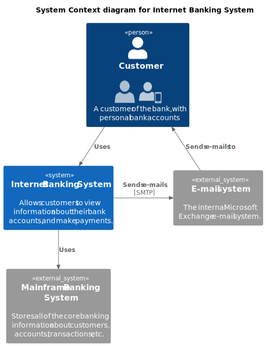

# Arquitetura de Software - VídeosON (VO)

## Requisitos Funcionais e Não Funcionais

Detalhamento dos requisitos da arquitetura da aplicação **VídeosON (VO)** que servem como base para a definição da estrutura do sistema, dos módulos funcionais e das tecnologias adotadas.

### Requisitos Funcionais (RF)

| Código | Descrição                                                                 |
|--------|---------------------------------------------------------------------------|
| RF1    | Permitir o cadastro de novos usuários (clientes).                        |
| RF2    | Realizar autenticação segura dos usuários.                               |
| RF3    | Permitir a reprodução de vídeos sob demanda.                             |
| RF4    | Verificar se o vídeo já foi consumido anteriormente pelo cliente.        |
| RF5    | Garantir a continuidade da reprodução em caso de interrupções.           |
| RF6    | Tolerar falhas durante a reprodução, com reinicialização automática.     |
| RF7    | Permitir que administradores publiquem e removam vídeos da plataforma.   |

### Requisitos Não Funcionais (RNF)

| Código | Descrição                                                                 |
|--------|---------------------------------------------------------------------------|
| RNF1   | Utilizar serviços de streaming (como YouTube) com suporte a diferentes resoluções e proporções. |
| RNF2   | Apresentar mensagens informativas padronizadas ao usuário.               |
| RNF3   | Garantir uma interface responsiva em diferentes dispositivos.            |
| RNF4   | Adotar práticas de UX Design para fluidez na navegação.                  |
| RNF5   | Fornecer feedback visual e textual ao usuário em ações relevantes.       |

## Visão Geral - Macro da Aplicação

A aplicação VídeosON (VO) é uma plataforma de streaming voltada para o consumo e gerenciamento de vídeos sob demanda. Os usuários finais (clientes) poderão se cadastrar, autenticar e consumir vídeos por meio da aplicação, enquanto administradores terão a capacidade de publicar e organizar os conteúdos. A aplicação deve proporcionar uma experiência de uso fluida, segura e escalável, garantindo o cumprimento de requisitos funcionais e não funcionais.

### Diagrama de Casos de Uso (Estilo ASCII)

             ┌──────────────┐
             │   Usuário    │
             └──────┬───────┘
                    │
                    ▼
       ┌─────────────────────┐
       │   Validar Acesso    │◄─── include ───
       └─────────────────────┘
                    │
        ┌────────────┼─────────────┐
        ▼            ▼             ▼
«Cadastrar Usuário»  «Consumir Vídeo»  «Visualizar Histórico»
                             │
              ┌──────────────┼──────────────┐
              ▼              ▼              ▼
     «Controlar Interrupção» «Verificar Vídeo Consumido»

             ┌──────────────┐
             │ Administrador│
             └──────┬───────┘
                    │
                    ▼
            «Publicar Vídeo»

A solução proposta deverá garantir:

- Cadastro e autenticação de clientes com segurança e controle de sessões.
- Disponibilização de vídeos com verificação de consumo anterior.
- Tolerância a falhas e reinicialização em caso de erros durante a reprodução.
- Administração do conteúdo por meio de funcionalidades exclusivas para administradores.
- Interface padronizada, responsiva e orientada a práticas de UX Design.
- Monitoramento ativo do desempenho e das falhas da aplicação.

## Visão Tecnológica

### Estilo de Arquitetura

A arquitetura será orientada a microsserviços, permitindo a escalabilidade horizontal da aplicação e a separação clara de responsabilidades entre os componentes. A comunicação entre os serviços será realizada por meio de APIs REST e, para eventos críticos como falhas de execução, será adotada arquitetura orientada a eventos (Event-Driven Architecture).

A entrega dos vídeos será otimizada por meio de integração com serviços como YouTube (atendendo aos requisitos de resolução e proporção) e o uso de CDN (Content Delivery Network) para reduzir latência.

### Tecnologias e Ferramentas

| Camada              | Tecnologias                                 | Descrição                                                                 |
|---------------------|---------------------------------------------|---------------------------------------------------------------------------|
| Frontend            | React.js ou Vue.js                          | Desenvolvimento da interface de usuário responsiva                       |
| Backend             | Node.js (NestJS) ou Spring Boot             | Processamento de regras de negócio, autenticação e APIs REST             |
| Banco de Dados      | MySQL ou PostgreSQL                         | Armazenamento de usuários, vídeos e históricos de consumo                |
| Cache               | Redis                                       | Otimização de desempenho em acessos frequentes                           |
| Autenticação        | JWT (JSON Web Token)                        | Controle seguro e escalável de sessões                                   |
| Mensageria          | RabbitMQ ou Apache Kafka                    | Comunicação assíncrona entre microsserviços                              |
| Streaming           | API do YouTube + CDN                        | Entrega de vídeos com base em RNF1 e performance otimizada               |
| Monitoramento       | Prometheus e Grafana                        | Acompanhamento de falhas, latência e outros indicadores                  |
| Infraestrutura      | Docker, Kubernetes (opcional), GitHub Actions | Containerização, CI/CD, automação de deploy                             |

### Módulos e Componentes

| Módulo                        | Responsabilidade                                                          |
|------------------------------|---------------------------------------------------------------------------|
| Cadastro e Autenticação      | Gerencia criação de contas e acesso de clientes (RF1, RF2)                |
| Consumo de Vídeos            | Gerencia reprodução, interrupções e verificações de consumo (RF3, RF4, RF5, RF6) |
| Administração de Conteúdo    | Permite a publicação e exclusão de vídeos por administradores (RF7)       |
| Histórico de Consumo         | Registra e apresenta os vídeos já assistidos pelo cliente                 |
| Notificações e UX            | Exibe mensagens informativas padronizadas (RNF2, RNF3, RNF4, RNF5)        |
| Monitoramento e Tolerância   | Detecta falhas e garante tentativas de recuperação automáticas            |

## Observações Finais

A arquitetura proposta prioriza a experiência do usuário, a robustez da entrega de conteúdo e a facilidade de manutenção e escalabilidade do sistema. A segmentação por módulos e o uso de microsserviços contribuem para a evolução contínua da aplicação, com mínimo impacto entre as funcionalidades.

A integração com serviços externos como YouTube e o uso de CDN garantem o desempenho necessário para uma aplicação de streaming moderna. Os padrões adotados de autenticação e monitoramento asseguram a confiabilidade da solução.
